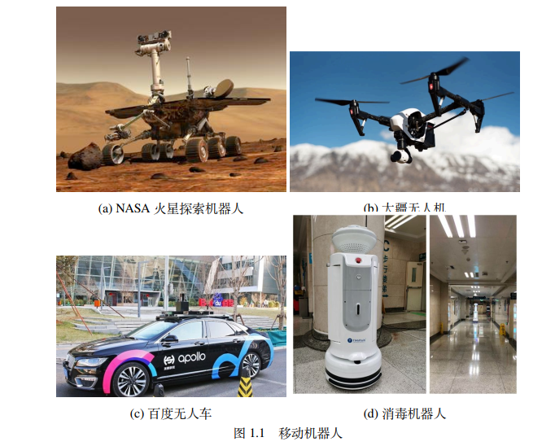
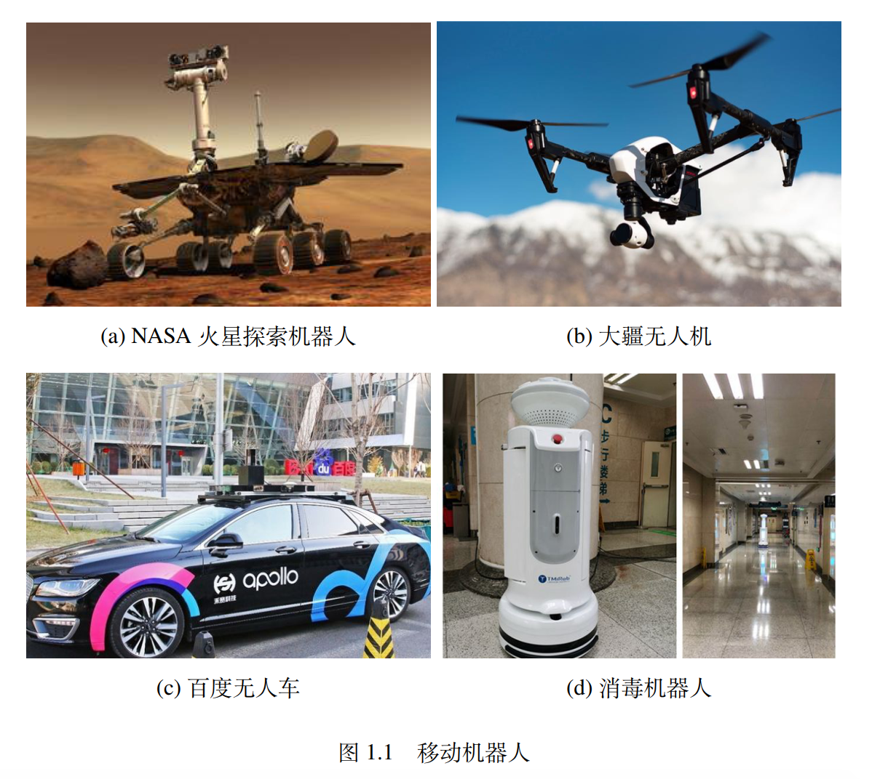

# Image Process
## Align Crop
Crop several images to get same height-width-ratio
### Dependency
1. numpy
2. opencv-python

### Run
`python align_crop.py image1 image2 image3 ...`

### Example
`python align_crop.py example/baidu_apollo.png example/dji_uav.png example/hospital_robot.png example/nasa_mars.png `

the four images with be croped and named `*_crop.png`

Before Crop

After Crop
